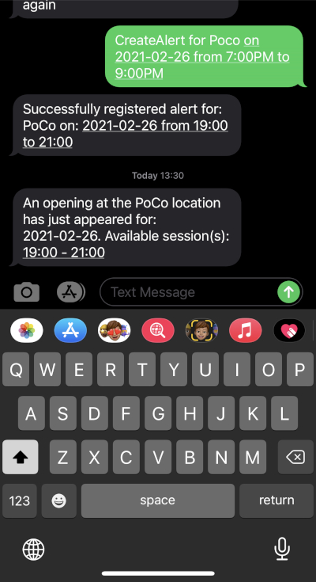
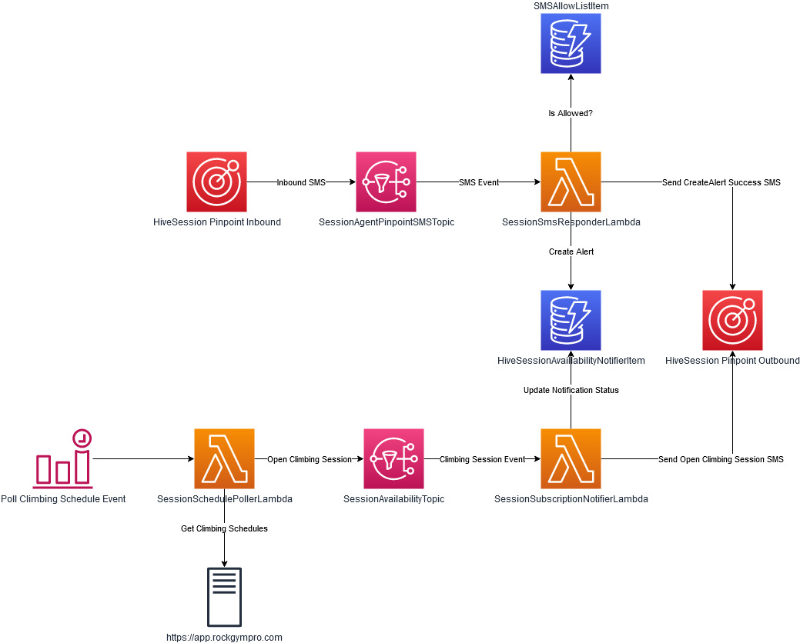

## Hive Session Agent
### About
The Hive is a popular set of climbing gyms located in the greater Vancouver area. Since COVID-19 started, all climbing sessions must be reserved through a booking system. Often times, the more popular gym sessions will book up immediately or require you to monitor for a session to open up.

As a result, I've create the "Hive Session Agent". It's a basic SMS chatbot that enables you to create alerts for climbing sessions at the Hive. When you create an alert, you'll be notified within 10 minutes if an opening appears. It can also be used to set a reminder for future climbing sessions that aren't available for booking yet.



### Architecture
For this project, I've gone with an entirely serverless workflow as outlined below:


### Milestones
- Hive Schedule Polling **[DONE]**
- Hive Session Notification **[DONE]**
- Hive Session SMS Alert Creation **[DONE]**
- Hive Session SMS Allow List **[DONE]**


### Setup
#### Pinpoint
1. Create pinpoint project with dedicated number for two-way SMS

#### Infrastructure
1. Install SAM
1. Create SAMUser IAM User with Admin permissions
1. Add AWS Credentials for SAM
1. Run:
```
./gradlew shadowJar
sam deploy --guided --parameter-overrides PinpointAppIdParameter=<App Id> PinpointDedicatedNumberParameter=<number> PinpointKeywordParameter=<keyword>
```
1. Add the SMS Topic as an event source for Pinpoint SMS

#### Allow Listing
By default allow listing is enabled for SMS. Allow list numbers by adding them to the `SMSAllowList` DDB table or adding an environment variable: `SESSION_AGENT_ALLOW_LIST_ENABLED` to false for class SmsResponderBotLambda.